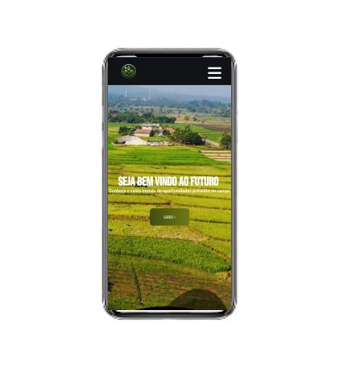

<h1>AgroFuture </h1>

    
    

<a href="https://stonerainbow19.github.io/AgroFuture_2024/">Acesse aqui<a> o site hospedado pelo <strong>GitHub Pages</strong>
 
<a href="https://agro-future-2024.vercel.app/">Acesse aqui<a> o site hospedado pelo <strong>Vercel</strong>
